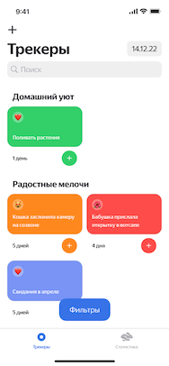
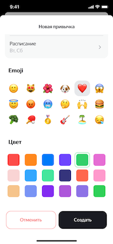
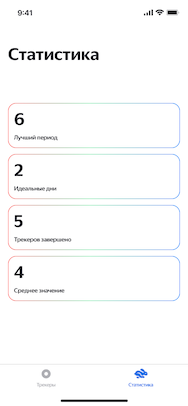

# TrackerApp

Приложение помогает пользователям формировать полезные привычки и контролировать их выполнение. При разработке приложения изучался фреймворк CoreData и архитектурный паттерн MVVM (приложение частично отрефакторено с MVC на MVVM).  
**Основные технологии:** MVC, MVVM (без combine и React-фреймворков), propertyWrapper, UIKit, Autolayout, CoreData, NSFetchedResultsController, NSPredicate, NSSortDescriptor, ObservableWrapper, BatchUpdates, YandexMobileMetrica, Swift Package Manager (SPM), CocoaPods, SnapshotTesting, Color Marshalling.

   

# ТЗ мобильного приложения для трекинга привычек

# Ссылки

[Дизайн Figma](https://www.figma.com/file/owAO4CAPTJdpM1BZU5JHv7/Tracker-(YP)?t=SZDLmkWeOPX4y6mp-0)

# Цели приложения

- Контроль привычек по дням недели;
- Просмотр прогресса по привычкам;

# Краткое описание приложения

- Приложение состоит из карточек-трекеров, которые создает пользователь. Он может указать название, категорию и задать расписание. Также можно выбрать эмодзи и цвет, чтобы отличать карточки друг от друга.
- Карточки отсортированы по категориям. Пользователь может искать их с помощью поиска и фильтровать.
- С помощью календаря пользователь может посмотреть какие привычки у него запланированы на конкретный день.
- В приложении есть статистика, которая отражает успешные показатели пользователя, его прогресс и средние значения.

# Функциональные требования

## Онбординг

При первом входе в приложение пользователь попадает на экран онбординга.

**Экран онбординга содержит:**

1. Заставку;
2. Заголовок и вторичный текст;
3. Page controls;
4. Кнопку «Вот это технологии».

**Алгоритмы и доступные действия:**

1. С помощью свайпа вправо и влево пользователь может переключаться между страницами. При переключении страницы page controls меняет состояние;
2. При нажатии на кнопку «Вот это технологии» пользователь переходит на главный экран. 

## Создание карточки привычки

На главном экране пользователь может создать трекер для привычки или нерегулярного события. Привычка – событие, которое повторяется с определенной периодичностью. Нерегулярное событие не привязано к конкретным дням.

**Экран создания трекера для привычки содержит:**

1. Заголовок экрана;
2. Поле для ввода названия трекера;
3. Раздел категории;
4. Раздел настройки расписания;
5. Раздел с эмоджи;
6. Раздел с выбором цвета трекера;
7. Кнопка «Отменить»;
8. Кнопка «Создать».

**Экран создания трекера для нерегулярного события содержит:**

1. Заголовок экрана;
2. Поле для ввода названия трекера;
3. Раздел категории;
4. Раздел с эмоджи;
5. Раздел с выбором цвета трекера;
6. Кнопка «Отменить»;
7. Кнопка «Создать».

**Алгоритмы и доступные действия:**

1. Пользователь может создать трекер для привычки или нерегулярного события. Алгоритм создания трекеров аналогичен, но в событии отсутствует раздел расписания.
2. Пользователь может ввести название трекера;
    1. После ввода одного символа появляется иконка крестика. При нажатии на иконку пользователь может удалить введенный текст;
    2. Максимальное количество символов – 38;
    3. Если пользователь превысил допустимое количество, появляется текст с ошибкой;
3. При нажатии на раздел «Категория» открывается экран выбора категории;
    1. Если пользователь ранее не добавлял категории, то стоит заглушка;
    2. Синей галочкой отмечена последняя выбранная категория;
    3. При нажатии на «Добавить категорию» пользователь может добавить новую. 
        1. Откроется экран с полем для ввода названия. Кнопка «Готово» неактивна;
        2. Если введен хотя бы 1 символ, то кнопка «Готово» становится активной;
        3. При нажатии на кнопку «Готово» открывается экран выбора категории. Созданная категория отмечена синей галочкой; 
        4. При нажатии на категорию пользователь возвращается на экран создания привычки. Выбранная категория отображается на экране создания привычки вторичным текстом под заголовком «Категория»;
4. В режиме создания привычки есть раздел «Расписание». При нажатии на раздел открывается экран с выбором дней недели. Пользователь может переключить свитчер, чтобы выбрать день повторения привычки;
    1. При нажатии на «Готово» пользователь возвращается на экран создания привычки. Выбранные дни отображаются на экране создания привычки вторичным текстом под заголовком «Расписание»;
        1. Если пользователь выбрал все дни, то отображается текст «Каждый день»;
5.  Пользователь может выбрать эмодзи. Под выбранным эмодзи появляется подложка;
6. Пользователь может выбрать цвет трекера. На выбранном цвете появляется обводка;
7. При нажатии кнопки «Отменить» пользователь может прекратить создание привычки;
8. Кнопка «Создать» неактивна пока не заполнены все разделы. При нажатии на кнопку открывается главный экран. Созданная привычка отображается в соответствующей категории;

## Просмотр главного экрана

На главном экране пользователь может просмотреть все созданные трекеры на выбранную дату, отредактировать их и посмотреть статистику.

**Главный экран содержит:**

1. Кнопку «+» для добавления привычки;
2. Заголовок «Трекеры»;
3. Текущая дата;
4. Поле для поиска трекеров;
5. Карточки трекеров по категориям. Карточки содержат:
    1. Емодзи;
    2. Название трекера;
    3. Количество затреканных дней;
    4. Кнопку для отметки выполненной привычки;
6. Кнопка «Фильтр»;
7. Таб-бар.

**Алгоритмы и доступные действия:**

1. При нажатии на «+» всплывает шторка с возможностью создать привычку или нерегулярное событие;
2. При нажатии на дату открывается календарь. Пользователь может переключаться между месяцами. При нажатии на число приложение показывает соответствующие дате трекеры;
3. Пользователь может искать трекеры по названию в окне поиска;
    1. Если ничего не найдено, то пользователь видит заглушку;
4. При нажатии на «Фильтры» всплывает шторка со списком фильтром;
    1. Кнопка фильтрации отсутствует, если на выбранный день нет трекеров;
    2. При выборе «Все трекеры» пользователь видит все трекеры на выбранный день;
    3. При выборе «Трекеры на сегодня» ставится текущая дата и пользователь видит все трекеры на этот день;
    4. При выборе «Завершенные» пользователь видит привычки, которые были выполнены пользователем в выбранный день;
    5. При выборе «Не завершенные» пользователь видит невыполненные трекеры в выбранный день;
    6. Текущий фильтр отмечен синей галочкой;
    7. При нажатии на фильтр шторка скрывается, на экране отображены соответствующие трекеры;
        1. Если ничего не найдено, то пользователь видит заглушку;
5. При скролле вниз и вверх пользователь может просматривать ленту;
    1. Если изображение карточки не успели загрузиться, то отображается системный лоадер;
6. При нажатии на карточку фон под ней размывается и всплывает модальное окно;
    1. Пользователь может закрепить карточку. Карточка попадет в категорию «Закрепленные» в вверху списка;
        1. При повторном нажатии пользователь может открепить карточку;
        2. Если закрепленных карточек нет, то категория «Закрепленные» отсутствует;
    2. Пользователь может отредактировать карточку. Всплывает модальное с функционалом аналогичным при создании карточки. Дополнительно пользователь может увеличить или уменьшить количество затреканных дней;
    3. При нажатии на «Удалить» всплывает action sheet.
        1. Пользователь может подтвердить удаление карточки. Все данные о ней должны быть удалены;
        2. Пользователь может отменить действие и вернуться на главный экран; 
7. С помощью таб бара пользователь может переключаться между разделами «Трекеры» и «Статистика».

## Редактирование и удаление категории

Во время создания трекера пользователь может отредактировать категории в списке или удалить ненужные.

**Алгоритмы и доступные действия:**

1. При долгом нажатии на категорию из списка фон под ней размывается и появляется модальное окно;
    1. При нажатии на «Редактировать» всплывает модальное окно. Пользователь может отредактировать название категории. При нажатии на кнопку «Готово» пользователь возвращается в список категорий;
    2. При нажатии «Удалить» всплывает action sheet. 
        1. Пользователь может подтвердить удаление категории. Все данные о ней должны быть удалены;
        2. Пользователь может отменить действие; 
        3. После подтверждения или отмены пользователь возвращается в список категорий;

## Просмотр статистики

Во вкладке статистики пользователь может посмотреть успешные показатели, свой прогресс и средние значения.

**Экран статистики содержит:**

1. Заголовок «Статистика»;
2. Список со статистическими показателями. Каждый показатель содержит:
    1. Заголовок-цифру;
    2. Вторичный текст с названием показателя;
3. Таб-бар

**Алгоритмы и доступные действия:**

1. Если данных нет ни под одному показателю, то пользователь видит заглушку;
2. Если есть данные хотя бы под одному показателю, то статистика отображается. Показатели без данных отображаются с нулевым значением;
3. Пользователь может просмотреть статистику по следующим показателям:
    1. «Лучший период» считает максимальное количество дней без перерыва по всем трекерам;
    2. «Идеальные дни» считает дни, когда были выполнены все запланированные привычки;
    3. «Трекеров завершено» считает общее количество выполненных привычек за все время;
    4. «Среднее значение» считает среднее количество привычек, выполненных за 1 день.

## Темная тема

В приложении есть темная тема, которая меняется в зависимости от настроек системы устройства.

# Нефункциональные требования

1. Приложение должно поддерживать iPhone X и выше и адаптировано под iPhone SE, минимальная поддерживаемая версия операционной системы - iOS 13.4;
2. На усмотрение исполнителя приложение может быть адаптировано под iPad;
3. В приложении используется стандартный шрифт iOS – SF Pro.
4. Для хранения данных о привычках используется Core Data.